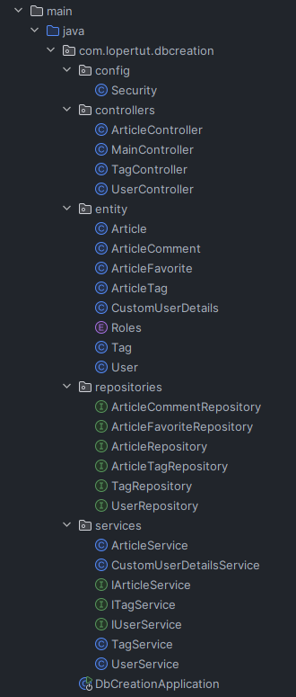
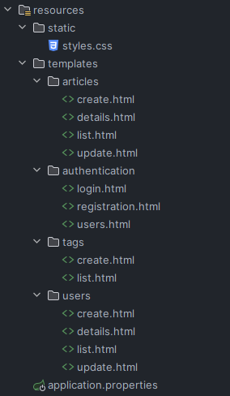
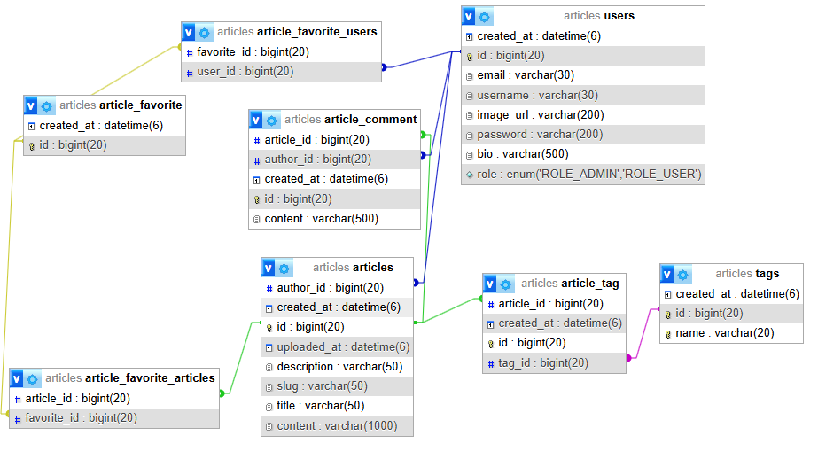

Article

Веб приложение созданное для просмотра и прочтения статей на разные темы. Приложение предастовляет возможность создание статье от своего имени. Также реализована система авторизации.

Структура проекта:

config - Конфигурация Spring Security
controller - Контроллеры 
entity - Сущности которые представляют таблицы в базе данных и их отношения
repositories - Интерфейсы Spring Data JPA для работы с БД
services - бизнес логика и их интерфейсы
DbCreationApplication - Главный класс для запуска программы
resources - Папка для хранения статических и конфигурационных файлов
static - Папка для статичных файлов
templates - Папка для хранения html файлов разделеных по смыслу
application.properties - конфигурационный файл

Гайд по запуску проекта: 

Требования:
версия java - 17 и выше

версия java - 17 и выше

версия maven 3.6.0 b выше

mariaDB/MySQL для работы с базой данных

Шаги по запуску:

1. Клонирование проекта:
git clone https://github.com/lopertut/ivlevaDbCreation
2. Сборка проекта:
mvn clean install
3. Запуск проекта:
mvn spring-boot:run
4. Приложение будет находотся по адрессу:
http://localhost:8081/

ER-диаграмма:

Функциональность:

Статьи:
Создание новой статьи
Просмотр всех статей
Просмотр статьи по ID
Обновление статьи
Удаление статьи

Юзеры:
Регистрация нового пользователя
Авторизация пользователя
Просмотр профиля пользователя
Обновление профиля пользователя
Удаление пользователя

Теги:
Создание нового тега
Просмотр всех тегов
Удаление тега

Роли юзеров:

гость:
Может просматривать статьи
Не может создавать, редактировать, удалять статьи

админ:
Может редактировать / удалять любые статьи
Имеет расширенные права

юзер:
Может создавать статьи